# D3 Axis

`Axis`为增强可读性提供了参考标记。

*如何使用 D3 的轴模块创建图表轴。本文涵盖轴方向、转换、刻度数、自定义刻度值、刻度格式和刻度大小。*

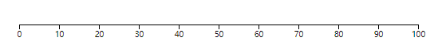

## Axis

创建 `D3 Axis`需要两件事：

- 包含`Axis`的 `SVG `元素（通常是`g`元素）
- `D3 Scale`

> 注: domain一般中文译为域, range译为范围; 为避免中文意思重叠，下文用domain和range。

D3 比例函数具有`domain`和`range`（参见[比例](https://www.d3indepth.com/scales)章节）。`domain`指定输入范围例如`[0, 100]`），`range`定义比例的输出范围（例如`[0, 1000]`）。

当使用` D3 Scale functions`定义轴时，比例`domain`确定最小和最大刻度值，范围确定轴的长度。

要创建轴：

- 使用`d3.axisBottom`,`d3.axisTop`,`d3.axisLeft`,`d3.axisRight`函数来生成一个`axis`;
- 选择容器元素, 通过`.call`将`axis`进行传递。

这是一个基本示例：

```
<svg width="600" height="100">
  <g transform="translate(20, 50)"></g>
</svg>

let scale = d3.scaleLinear().domain([0, 100]).range([0, 500]);

let axis = d3.axisTop(scale);
// let axis = d3.axisBottom(scale);

d3.select('svg g')
  .call(axis);
```

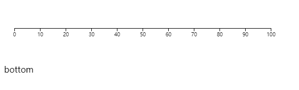

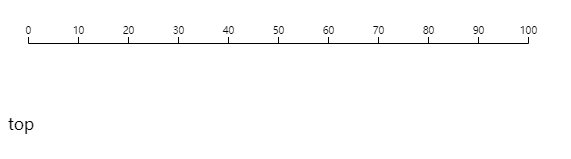

> https://codepen.io/wantnocode/pen/dymwRRM `.call`将在[选择](https://www.d3indepth.com/selections)章节中介绍。

### Axis 方向

`d3.axisBottom`, `d3.axisTop`,`d3.axisLeft`和`d3.axisRight` 分别用于生成适合图表底部、顶部、左侧和右侧的`Axis`：

```
<svg width="500" height="500">
  <g id="left" transform="translate(30, 40)"></g>
  <g id="right" transform="translate(450, 40)"></g>
  <g id="top" transform="translate(40, 30)"></g>
  <g id="bottom" transform="translate(40, 450)"></g>
</svg>


let scale = d3.scaleLinear().domain([0, 100]).range([0, 400]);

let axisLeft = d3.axisLeft(scale);
let axisRight = d3.axisRight(scale);
let axisTop = d3.axisTop(scale);
let axisBottom = d3.axisBottom(scale);

d3.select('#left').call(axisLeft);
d3.select('#right').call(axisRight);
d3.select('#top').call(axisTop);
d3.select('#bottom').call(axisBottom);
```

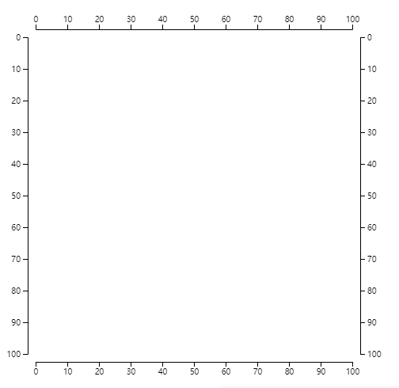

> https://codepen.io/wantnocode/pen/gOeZRGx


### scale类型

可以传入任何具有数字输出的`scale functions`。包括`scaleLinear`、`scaleSqrt`、`scaleTime`和`scaleBand`。`scalePoint`等等... 

以下是使用每种比例类型的示例：

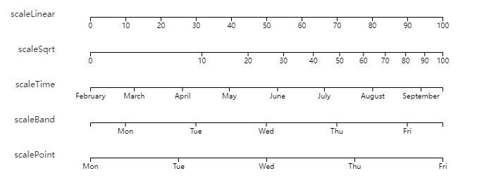

> https://codepen.io/wantnocode/pen/wvmRepy

### Transitions 过渡

如果刻度的域发生变化，可以通过`.call(axis)`再次调用来更新轴：

```
d3.select('svg g')
  .call(axis);
```

您还可以添加调用以`.transition`使轴动画：

```
d3.select('svg g')
  .transition()
  .call(axis);
```

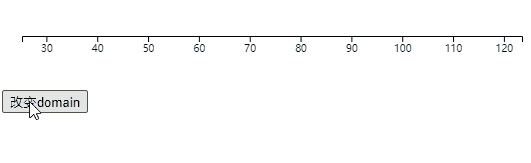

> https://codepen.io/wantnocode/pen/wvmRqwY

## Axis配置项

您可以通过以下方式配置轴：

- 指定刻度数或指定刻度值
- 指定刻度标签的格式（例如，添加百分号）
- 指定刻度大小

### ticks

您可以使用该`.ticks`方法指定轴有多少刻度：

```
let scale = d3.scaleLinear().domain([0, 100]).range([0, 500]);

let axis = d3.axisBottom(scale);

axis.ticks(10);
//Is equivalent to:
//axis.tickArguments([10]);

d3.select('svg g')
  .call(axis);
```

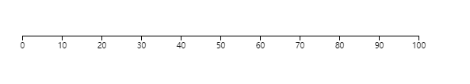

> 根据配置使用尽可能多的刻度，但在某些情况下，它会有所差异的使用以使刻度值成为整数。
>
> https://codepen.io/wantnocode/pen/vYRvJOp


### tickValues

您可以通过将刻度值数组传递给`.tickValues`方法来指定轴的刻度值：

```
let scale = d3.scaleLinear().domain([0, 30]).range([0, 300]);

let axis = d3.axisBottom(scale);

axis.tickValues([1, 2, 3, 5, 8, 13, 21]);

d3.select('svg g')
	.call(axis);
```

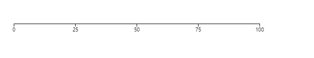

> https://codepen.io/wantnocode/pen/YzadxWY

### **tickFormat**

您可以通过两种方式格式化刻度标签。

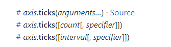

**第一种是使用该`.ticks`方法并传入一个固定格式字符串([参考d3-format](https://github.com/d3/d3-format)))作为第二个参数**：

```
let scale = d3.scaleLinear().domain([0, 100]).range([0, 500]);

let axis = d3.axisBottom(scale);

axis.ticks(4, "$.2f");

d3.select('svg g')
  .call(axis);
```

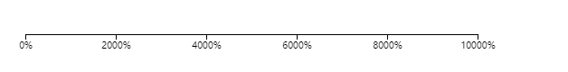


> https://codepen.io/wantnocode/pen/dymwVva

**第二种方法是将格式化函数传递给`.tickFormat`方法。该函数接受一个值并输出一个格式化的值**。

在此示例中，我们为每个刻度值添加一个 % 符号：

```
let scale = d3.scaleLinear().domain([0, 100]).range([0, 500]);

let axis = d3.axisBottom(scale);

axis.ticks(4)
  .tickFormat(function(d) {
    return d + "%";
  });

d3.select('svg g')
  .call(axis);
```

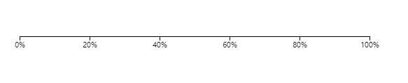

> https://codepen.io/wantnocode/pen/wvmRrrG

### Tick size

刻度的长度可以使用该`.tickSize`方法设置。您还可以使用以下方法设置刻度和刻度标签之间的距离`.tickPadding`：

```
let scale = d3.scaleLinear().domain([0, 100]).range([0, 500]);

let axis = d3.axisBottom(scale)
  .tickPadding(10)
  .tickSize(10);

d3.select('svg g')
	.call(axis);
```

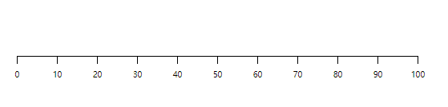


> https://codepen.io/wantnocode/pen/ZExVXXv

