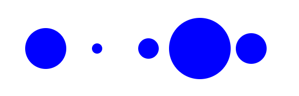
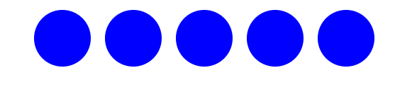
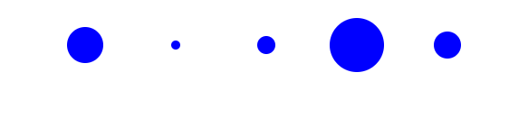
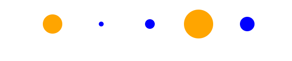
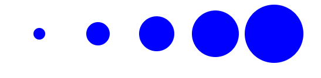
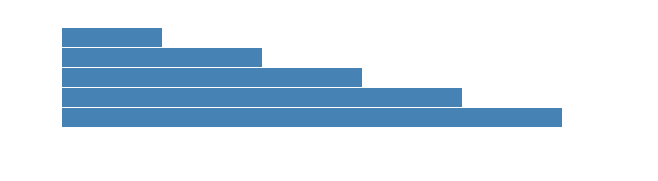
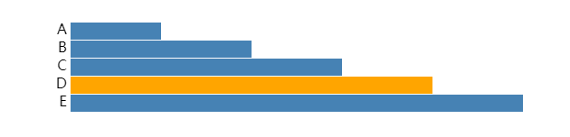
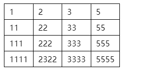
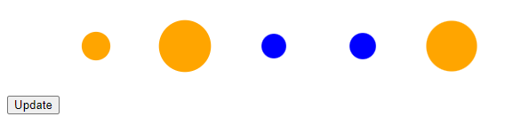

# D3 Data Joins

*本文介绍如何将数据数组连接到 `D3 Selection`。我们将介绍如何创建数据连接、如何更新数据连接、如何连接对象数组。*

`Data Joins`数据连接在数据数组和 HTML 或 SVG 元素的选择之间创建对应关系。

将数组加入 HTML/SVG 元素意味着：

- 添加或删除 HTML（或 SVG）元素，以便**每个数组元素都有一个对应的 HTML（或 SVG）元素**
- 每个 HTML/SVG 元素都可以根据其对应数组元素的值进行**调整大小和样式**


例如，假设您有一个包含五个数字的`array(数组)`，您想将其加入`circle`元素：

```
[ 40, 10, 20, 60, 30 ]
```

将每个圆的半径设置为相应数组的值。第一个圆的半径为 40，第二个圆的半径为 10，以此类推：

```
d3.select('.chart')
  .selectAll('circle')
  .data(myData)
  .join('circle')
  .attr('cx', function(d, i) {
    return i * 100;
  })
  .attr('cy', 50)
  .attr('r', function(d) {
    return d;
  })
  .style('fill', 'blue');
```




> [在codepen中尝试编辑上面示例](https://codepen.io/wantnocode/pen/gOeQrJW)

## 怎么创建Data Join


> 在 D3 的第 5 版之前，`Data Join`(数据连接)并不是那么容易学习（您必须了解`enter、exit 、append 、remove`）。幸运的是，对于5 + 版本，`data joining` 要容易得多！**[d3 V-1.4 join notebook](https://observablehq.com/@d3/selection-join)**


创建Data Join的一般模式是：

```
d3.select(container) // container css选择器一般为单个元素 html/svg容器
  .selectAll(element-type) // element-type 选中元素类型 例如 circle / div
  .data(array)   // array 加入数据的名称
  .join(element-type);  //执行链接 
```

通常在数据连接中使用上面这四种函数方法：

- `.select`定义将充当连接的 `HTML/SVG` 元素的容器（或父级）的元素。

- `.selectAll`定义将连接到每个数组元素的元素类型。

- `.data`定义正在加入的数组。

- `.join`执行连接。可以添加和删除 `HTML/SVG` 元素。

  

例子: 给定一个数组：

```
let myData = [40, 10, 20, 60, 30];
```

和一个`svg`包含元素的`g`元素：

```
<svg>
  <g class="chart">
  </g>
</svg>
```

您可以使用以下方法加入`myData`元素`circle`：

```
let myData = [40, 10, 20, 60, 30];

d3.select('.chart')
  .selectAll('circle')
  .data(myData)
  .join('circle');
```

在这个例子中：

- 容器是`g`元素
- 元素类型是`circle`
- 正在加入的数组是`myData`

运行此代码会创建 5 个圆圈：

```
<svg>
  <g class="chart">
    <circle></circle>
    <circle></circle>
    <circle></circle>
    <circle></circle>
    <circle></circle>
  </g>
</svg>
```

**但是打开界面看不到任何内容(一片空白)**，因为每个半径都为零。但是，如果您12并展开 SVG 元素 ,您将看到`circle`添加了五个元素：


### 更新连接的元素

`.join`返回一个包含所有连接元素的`选择`内容, 所有可以通过` selection`章节 介绍的 `.attr .style...`等方法进行更新 

例如，可以使用以下方法设置每个圆的中心、半径和颜色：

```
var myData = [40, 10, 20, 60, 30];

d3.select('.chart')
  .selectAll('circle')
  .data(myData)
  .join('circle')
  .attr('cx', 200)
  .attr('cy', 50)
  .attr('r', 40)
  .style('fill', 'orange');
```


您只会看到一个圆圈，因为所有五个圆圈的位置和大小都相同。

> [在codepen中尝试编辑上面示例](https://codepen.io/wantnocode/pen/xxWQOEw)

### 数据驱动更新

如果传入一个**函数**`.attr`，或者您可以以**数据驱动的**方式`.style`更新 HTML/SVG 元素。

**为selection 中的每个元素**调用该函数。它有两个参数，通常命名为`d`和`i`。

第一个参数 ( `d`) 表示相应的数组元素（或“连接值”）。第二个参数`i`表示选择中元素的索引。

函数的返回值用于设置属性或样式值。

让我们将一个函数传递给第一个`.attr`：

```
var myData = [40, 10, 20, 60, 30];

d3.select('.chart')
  .selectAll('circle')
  .data(myData)
  .join('circle')
  .attr('cx', function(d, i) {
    return i * 100;
  })
  .attr('cy', 50)
  .attr('r', 40)
  .style('fill', 'blue');
```

 D3 将每个圆圈的`cx`属性设置为`i * 100`。`i`是选择中的索引，因此第一个圆圈将位于`0`，下一个位于`100`，依此类推：



> [在codepen中尝试编辑上面示例](https://codepen.io/wantnocode/pen/oNqQxrj)

现在让我们`r`根据连接的值进行设置：

```
var myData = [40, 10, 20, 60, 30];

d3.select('.chart')
  .selectAll('circle')
  .data(myData)
  .join('circle')
  .attr('cx', function(d, i) {
    return i * 100;
  })
  .attr('cy', 50)
  .attr('r', function(d) {
    return d / 2;
  })
  .style('fill', 'blue');
```



> [在codepen中尝试编辑上面示例](https://codepen.io/wantnocode/pen/MWVzeKx)

`.attr`您可以在传递到和的函数中放置任意数量的逻辑`.style`。例如，如果它的连接值大于 30，让我们为圆着色：

```
var myData = [40, 10, 20, 60, 30];

d3.select('.chart')
  .selectAll('circle')
  .data(myData)
  .join('circle')
  .attr('cx', function(d, i) {
    return i * 100;
  })
  .attr('cy', 50)
  .attr('r', function(d) {
    return d / 2;
  })
  .style('fill', function(d) {
    return d > 30 ? 'orange' : 'blue';
  });

```



> [在codepen中尝试编辑上面示例](https://codepen.io/wantnocode/pen/LYdXZZN)

### 添加链接对象数组

使用 D3 构建数据可视化时，您通常会连接对象数组（而不是数字数组）。例如：

```
var persons = [
  { name: 'A', score: 10},
  { name: 'B', score: 20},
  { name: 'C', score: 30},
  { name: 'D', score: 40},
  { name: 'E', score: 50}
];
```

您可以像以前一样加入对象数组。但是，当将函数传递给`.attr`或者`.style`时，`d`参数是一个对象。这意味着您通常会引用该对象的**属性**。

例如：

```
.attr('r', function(d) {
    return d.score;
  })
```

完整示例：

```
var persons = [
  { name: 'A', score: 10},
  { name: 'B', score: 20},
  { name: 'C', score: 30},
  { name: 'D', score: 40},
  { name: 'E', score: 50}
];

d3.select('.chart')
  .selectAll('circle')
  .data(persons)
  .join('circle')
  .attr('cx', function(d, i) {
    return (i+1) * 100;
  })
  .attr('cy', 50)
  .attr('r', function(d) {
    return d.score;
  })
  .style('fill', 'blue');

```



> [在codepen中尝试编辑上面示例](https://codepen.io/wantnocode/pen/jOzQrMQ)

构建一个简单的条形图。将`circle`设置为`rect`元素，而不是加入`text`元素：

```
var persons = [
  { name: 'A', score: 10},
  { name: 'B', score: 20},
  { name: 'C', score: 30},
  { name: 'D', score: 40},
  { name: 'E', score: 50}
];
// 加入rect
d3.select('.bars')
  .selectAll('rect')
  .data(persons)
  .join('rect')
  .attr('height', 19)
  .attr('width', function(d) {
    return d.score * 10;
  })
  .attr('y', function(d, i) {
    return i * 20;
  });

```



图表还可以加入`text`说明:

```
d3.select('.labels')
  .selectAll('text')
  .data(persons)
  .join('text')
  .attr('y', function(d, i) {
    return i * 20 + 13;
  })
  .text(function(d) {
    return d.name;
  });
```



哇! 看到这里我们可以用D3去构造一个简单的条形图了  恭喜恭喜  ~~~

> [在codepen中尝试编辑上面示例](https://codepen.io/wantnocode/pen/JjLeRmZ)


**插曲示例, 假设您有一个二维数组 ,想将其加入表格`table`:**

```
[
  [1,  2, 3, 5],
  [ 11, 22, 33, 55],
  [ 111, 222, 333,555],
  [ 1111,   2322,  3333, 5555]
];
```

选择body元素添加 table元素 ,依次进行选中元素-`data join` ,选中元素 -`data join`:

```
d3.select("body")
  .append("table")
  .selectAll("tr")
  .data(matrix)
  .join("tr")
  .selectAll("td")
  .data(d => d)
  .join("td")
    .text(d => d);
```



> [在codepen中尝试编辑上面示例](https://codepen.io/wantnocode/pen/KKorzoQ)

## 数据更新,图表如何更新

如果数据数组发生更改**，您将需要再次执行连接(data join)**。

因此我们通常将连接代码放在一个函数中。每当数据发生变化时，我们都会调用这个函数。

通常命名函数`update`。例如：

```
var myData = [40, 10, 20, 60, 30];

function update(data) {
  d3.select('.chart')
    .selectAll('circle')
    .data(data)
    .join('circle')
    .attr('cx', function(d, i) {
      return (i+1) * 100;
    })
    .attr('cy', 50)
    .attr('r', function(d) {
      return 0.5 * d;
    })
    .style('fill', function(d) {
      return d > 30 ? 'orange' : 'blue';
    });
}

update(myData);

```


在前面的示例中，数据永远不会改变，所以让我们添加一个按钮，单击该按钮会获取一些随机数据并调用`update`：

```
function getData() {
  let data = [];
  for(let i=0; i< 5; i++) {
    data.push(Math.random() * 60);
  }

  return data;
}

function update(data) {
  d3.select('.chart')
    .selectAll('circle')
    .data(data)
    .join('circle')
    .attr('cx', function(d, i) {
      return i * 100;
    })
    .attr('cy', 50)
    .attr('r', function(d) {
      return 0.5 * d;
    })
    .style('fill', function(d) {
      return d > 30 ? 'orange' : 'blue';
    });
}

function updateAll() {
  let myData = getData();
  update(myData);
}

updateAll();

d3.select("button")
  .on("click", updateAll);

```



`getData`返回一个包含随机数的随机值的数组。因此，每次单击按钮时，数据，圆会相应更新。

> [在codepen中尝试编辑上面示例](https://codepen.io/wantnocode/pen/RwMqGyd)


### 调试

当 D3 执行数据连接时，它会为`__data__`选择中的每个 DOM 元素添加一个属性，并将连接的数据分配给它。

我们可以在谷歌浏览器中单击选中一个元素，选择“检查”并在控制台输入：（`$0`表示正在检查的元素。）

```
$0.__data__
```


以这种方式检查连接的数据在调试时特别有用，因为它允许我们检查我们的数据连接是否按预期运行。

