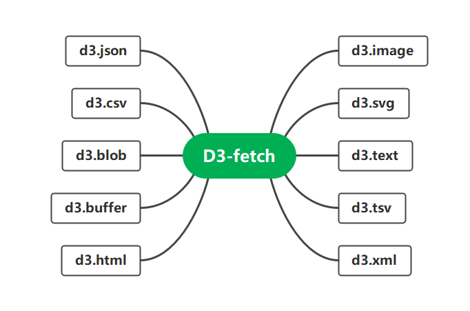
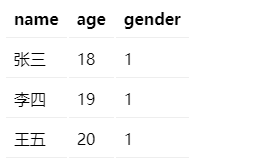
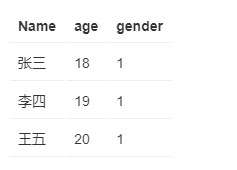

# D3-fetch



*如何使用 `D3 fetch`请求和解析 CSV 和 JSON 数据。*

> **自 D3 5.0 起，`d3-request`(~~对于XMLHttpRequest 提供了一个方便的替代方案~~)该模块已弃用；请使用[d3-fetch](https://github.com/d3/d3-fetch)。**

通常, 请求的数据（或资源）将具有**URL**（统一资源定位器），例如`https://wlove/my-csv.csv`.


`fetch`提供了方便的解析。例如，要加载一个文本文件：

```
const text = await d3.text("/path/to/file.txt");
console.log(text); // Hello, world!
```

加载和解析 CSV 文件：

```
const data = await d3.csv("/path/to/file.csv");
console.log(data); // [{"Hello": "world"}, …]
```


`D3 fetch `使请求数据相对简单。

本章将重点介绍构建可视化中请求常见的数据格式，即 CSV,  JSON。

### 请求 CSV 数据

CSV 文件是包含表格数据的文本文件。例如：

```
rank,workers,company,state_l,city,growth,revenue,industry
1,227,Fuhu,California,El Segundo,158956.9106,195640000,Consumer Products & Services
2,191,Quest Nutrition,California,El Segundo,57347.9246,82640563,Food & Beverage
3,145,Reliant Asset Management,Virginia,Arlington,55460.1646,85076502,Business Products & Services
4,62,Superfish,California,Palo Alto,26042.963,35293000,Software
5,92,Acacia Communications,Massachusetts,Maynard,20690.4578,77652360,Telecommunications
...
```

通常从电子表格和数据库中导出 CSV 文件。在网络上找到的大部分开放数据也是 CSV 格式。

通常（但不总是）第一行包含每个字段的名称（`rank`、`workers`等`company`）。其余行包含数据。每个值用逗号分隔。

可以使用`d3.csv`请求 CSV 文件：

```
d3.csv('/A/A.csv')
  .then(function(data) {
    console.log(data);
  });
```

`d3.csv`接受 URL 作为其第一个参数并返回一个**Promise**对象。

一个 promise 对象代表一个**异步**操作。异步操作是其结果是未来某个时间的操作。这意味着您的代码可以在发起请求后立即继续运行。

当浏览器接收到请求的数据时，promise 就**完成**了，传递给 promise`.then`方法的函数就会被调用。

> 你不需要完全理解 Promise 就可以使用`d3.csv`. 要记住的主要事情是将回调函数传递给`.then`方法。文件到达时调用回调方法。它的第一个参数是数据。

完成请求后，D3 将传入的 CSV 文件转换为对象数组。每个对象代表一行数据：

```
"[{'name':'张三','age':'18','gender':'1'},{'name':'李四','age':'19','gender':'1'},{'name':'王五','age':'20','gender':'1'}]"
```

> `d3.csv`假设第一行包含字段名称。
>
> 请注意，所有数字都由字符串表示。后面演示将这些转换回数字。

上面的数组可以加入 HTML 或 SVG 元素。例如：

```
function update(data) {
  d3.select('#content tbody')
    .selectAll('tr')
    .data(data)
    .join('tr')
    .html(function(d) {
      let html = '<tr>';
      html += '<td>' + d.name + '</td>';
      html += '<td>' + d.age + '</td>';
      html += '<td>' + d.gender + '</td>';
      // html += '<td>' + d.workers + '</td>';
      html += '</tr>';
      return html;
    });
}

d3.csv('https://wantnocode.github.io/test1.csv')
  .then(function(data) {
    update(data);
  });
```



> https://codepen.io/wantnocode/pen/BarvYya

#### row(行)转换

前面示例来看，D3 将 CSV 文件中的数字解释为**字符串**。这个可以指定一个可选的**row**转换函数来将**row**对象映射和过滤到更合适具体的表示形式。

通俗来说,可以通过将函数`d3.csv`作为第二个参数传入来完成。对每一行数据调用该函数，然后返回一个带有任何适当转换的新对象。

在此示例中，我们将字符串转换为数字（在适当的情况下）并重命名一些变量名称：

```
function convertRow(d) {
  return {
     name:d.name,
     age:+d.name,
     gender:+d.name
  }
 } 
```

> 运算符将`+`字符串转换为数字。

现在数据数组如下所示：

```json
"[{'name':'张三','age':18,'gender':1},{'name':'李四','age':19,'gender':1},{'name':'王五','age':20,'gender':1}]"
```


### 请求 JSON 数据

`JSON `是一种密切反映 JavaScript 数组和对象的文件格式。它允许嵌套结构，使其优于表格文件格式。

这是位于以下位置的 JSON 文件的示例`https://wantnocode.github.io/test.json`：

```
[
  {
    "name": "张三",
    "age": 18,
    "gender": 1
  },
  {
    "name": "李四",
    "age": 19,
    "gender": 1
  },
  {
    "name": "王五",
    "age": 20,
    "gender": 1
  }
]
```

您使用以下命令请求 JSON 文件`d3.json`：

```
d3.json('https://wantnocode.github.io/test.json')
  .then(function(data) {
    update(data);
  });
```

当 JSON 文件到达时，D3 将其转换为 JavaScript 数组或对象,

可以将其加入 HTML 或 SVG 元素：

```
function update(data) {
  d3.select('#content tbody')
    .selectAll('tr')
    .data(data)
    .join('tr')
    .html(function(d) {
      let html = '<tr>';
      html += '<td>' + d.name + '</td>';
      html += '<td>' + d.age + '</td>';
      html += '<td>' + d.gender + '</td>';
      html += '</tr>';
      return html;
    });
}
```



>  https://codepen.io/wantnocode/pen/WNzLMeQ

> 与 CSV 数据不同，JSON 数据不一定是对象数组，因此`d3.json`不支持行转换函数。

