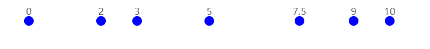
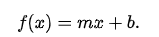
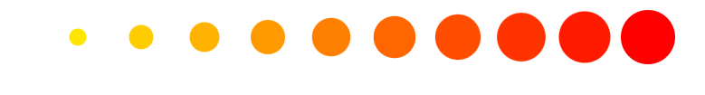
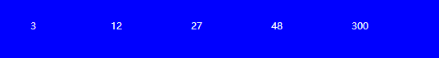
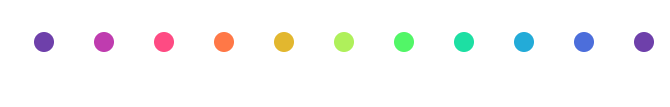
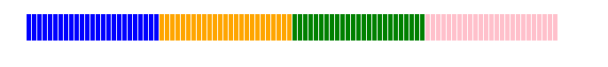
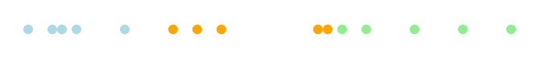
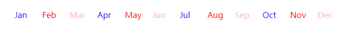
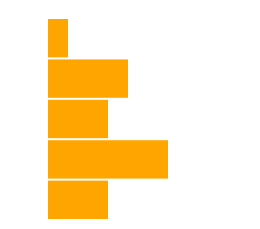
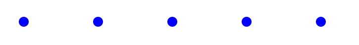

# D3 Scale functions 比例函数

> 通俗地说：`scale`将某个区间（称为**domain**）中的数字转换为另一个区间（称为**range**）中的数字。

*如何使用 D3 比例函数，本章将从输入输出（返回）的角度先进行分类,并覆盖讲解`Linear`线性、`Power`幂、`log`对数、`Time`时间 、`Sqquential`顺序、`Quantize`量化、`Quantile`分位数、`Threshold`阈值、`Ordinal`序数。*

`Scale`函数是 **JavaScript** 函数：

- `input`输入（通常是数字、日期或类别）
- `return` 返回（例如坐标、颜色、长度或半径）

它们通常用于将数据值转换为视觉变量（例如位置、长度和颜色）。

------------------------------------------------------

例如，假设您有一些数据：

```
[ 0, 2, 3, 5, 7.5, 9, 10 ]
```

您可以使用以下方法创建`Scale`(比例)函数：

```
var myScale = d3.scaleLinear()
  .domain([0, 10])
  .range([0, 600]);
```

D3 创建一个函数，该函数`myScale`接受 0 到 10（**domain**）之间的输入，并将其映射到 0 到 600（**range**）之间的**输出**。

您可以使用`myScale`根据数据计算位置：

```
myScale(0);   // returns 0
myScale(2);   // returns 120
myScale(3);   // returns 180
...
myScale(10);  // returns 600
```



> [在codepen中尝试编辑上面示例](https://codepen.io/wantnocode/pen/vYRQyrL)


### D3 Scale types

D3 有大约 12 种不同的比例类型（`Linear、power、sequential、ordinal(band,Point)..` 等），从输入输出来看可以将它们分为 3 组：

- continuous input  &  continuous output  (输入输出都是连续)
- continuous input  &  discrete output  (输入连续,输出不连续)
- discrete input  &  discrete output  (输入输出都是不连续)

> 连续数据通常是数字数据，但也包括时间和日期。离散数据具有一定数量的值（例如一年中的十二个月）。）

依次举几个例子介绍下这些类型的使用:

### continuous input  &  continuous output  (输入输出都是连续)

接下来介绍从**`continuous input domain`(连续输入域)**映射到**`continuous output range`（连续输出范围）**的`scale functions`。

#### ScaleLinear

`ScaleLinear`可能是最常用的刻度类型，因为它们是将数据值转换为位置和长度的最合适的刻度。

他们使用线性函数在`domain`和`range`内进行插值。

```
var linearScale = d3.scaleLinear()
  .domain([0, 10])
  .range([0, 600]);

linearScale(0);   // returns 0
linearScale(5);   // returns 300
linearScale(10);  // returns 600
```

线性比例函数通常用于将数据值转换为位置和长度。它们在创建条形图、折线图和许多其他图表类型时很有用。

输出范围也可以指定为颜色：

```
var linearScale = d3.scaleLinear()
  .domain([0, 10])
  .range(['yellow', 'red']);

linearScale(0);   // returns "rgb(255, 255, 0)"
linearScale(5);   // returns "rgb(255, 128, 0)"
linearScale(10);  // returns "rgb(255, 0, 0)"
```

这对于等值线图等可视化很有用，也可以考虑`scaleQuantize`,`scaleQuantile`,`scaleThreshold`。

#### ScaleSqrt

`scaleSqrt`比例尺对于按面积（而不是半径）确定圆的大小很有用。

```
var sqrtScale = d3.scaleSqrt()
  .domain([0, 100])
  .range([0, 30]);

sqrtScale(0);   // returns 0
sqrtScale(50);  // returns 21.21...
sqrtScale(100); // returns 30
```



> [在codepen中尝试编辑上面示例](https://codepen.io/wantnocode/pen/abYQBre)

#### ScalePow

`scalePow`是更通用的版本`scaleSqrt`。该比例使用幂函数
$$
y = mx^k + b
$$
进行插值。指数`k`的值使用`.exponent()`:

```
var powerScale = d3.scalePow()
  .exponent(2)
  .domain([0, 1000])
  .range([0, 300]);

var myData = [100, 200, 300, 400, 1000];
// powerScale[item]
```



> [在codepen中尝试编辑上面示例](https://codepen.io/wantnocode/pen/OJvaWMO)

#### ScaleLog

`scaleLog`使用对数函数
$$
y = m log(x) + b
$$
.进行插值，当数据具有指数性质时可能很有用。

```
var logScale = d3.scaleLog()
  .domain([10, 100000])
  .range([0, 600]);

logScale(10);     // returns 0
logScale(100);    // returns 150
logScale(1000);   // returns 300
logScale(100000); // returns 600
```


#### Scale Time

`scaleTime`类似于，`scaleLinear`除了域表示为日期数组。（在处理时间序列数据时**非常有用。）**

```
timeScale = d3.scaleTime()
  .domain([new Date(2016, 0, 1), new Date(2017, 0, 1)])
  .range([0, 700]);

timeScale(new Date(2016, 0, 1));   // returns 0
timeScale(new Date(2016, 6, 1));   // returns 348.00...
timeScale(new Date(2017, 0, 1));   // returns 700
```


> [在codepen中尝试编辑上面示例](https://codepen.io/wantnocode/pen/BarGpWr)

#### scaleSequential

`scaleSequential`用于将**`domain`指定的域**到预定义**`interpolator`插值器**的输出范围。（插值器是一个函数，它接受 0 到 1 之间的输入并输出两个数字、颜色、字符串等之间的插值。）

D3 提供了许多预设插值器，包括许多彩色插值器。例如，您可以使用`d3.interpolateRainbow`创建众所周知的彩虹色(美感十足~)：

```
var sequentialScale = d3.scaleSequential()
  .domain([0, 100])
  .interpolator(d3.interpolateRainbow);

sequentialScale(0);   // returns 'rgb(110, 64, 170)'
sequentialScale(50);  // returns 'rgb(175, 240, 91)'
sequentialScale(100); // returns 'rgb(110, 64, 170)'
```



> [在codepen中尝试编辑上面示例](https://codepen.io/wantnocode/pen/rNdQjva)

--------------------------

#### **invert**

该方法允许您在给定**输出**`.invert()`值的情况下确定缩放函数的**输入**值（假设缩放函数具有数值域）：

```
let linearScale = d3.scaleLinear()
  .domain([0, 10])
  .range([0, 100]);

linearScale.invert(50);   // returns 5
linearScale.invert(100);  // returns 10
```

#### clamp

默认情况下，当输入值超出`domain(域)`时 输出值依然会进行计算 但是不会考虑`range`。

例如：

```
var x = d3.scaleLinear()
    .domain([10, 130])
    .range([0, 960]);

x(-10); // -160, outside range
x.invert(-160); // -10, outside domain
```

您可以使用以下方法**限制缩放**功能，以便输入值保持在域内`.clamp`：

```
x.clamp(true);
x(-10); // 0, clamped to range
x.invert(-160); // 10, clamped to domain
```

同时可以通过`.clamp(false)`关闭。

#### Multiple segments

`scaleLinear`、`scalePow`、和`scaleSqrt`的域和范围通常由两个值组成，但如果您提供 3 个或更多值，则比例函数会细分为多个段：

```
var linearScale = d3.scaleLinear()
  .domain([-10, 0, 10])
  .range(['red', '#ddd', 'blue']);

linearScale(-10);  // returns "rgb(255, 0, 0)"
linearScale(0);    // returns "rgb(221, 221, 221)"
linearScale(5);    // returns "rgb(111, 111, 238)"
```

-------------------------------------------------

### continuous input  &  discrete output  (输入连续,输出不连续[间断])

#### scaleQuantize

`scaleQuantize`接受连续输入并输出由范围定义的多个离散量。

```javascript
var quantizeScale = d3.scaleQuantize()
  .domain([0, 100])
  .range(['blue', 'orange', 'green', 'pink']);

quantizeScale(10);  // returns 'blue'
quantizeScale(30);  // returns 'orange'
quantizeScale(90);  // returns 'pink'
```

每个范围值都映射到域中相同大小的块，因此在上面的示例中：

- 0 ≤ *v* < 25 映射到 `blue`
- 25 ≤ *v* < 50 映射到`orange`
- 50 ≤ v < 75 映射到`green`
- 75 ≤ *v* < 100 映射到`pink`

其中*v*是输入值。



> [在codepen中尝试编辑上面示例](https://codepen.io/wantnocode/pen/RwMqpRY)

#### scaleQuantile

`scaleQuantile`将连续数字输入映射到离散值。`domain(域)`由**数字数组**定义：

```
var myData = [0, 5, 7, 10, 20, 30, 35, 40, 60, 62, 65, 70, 80, 90, 100];

var quantileScale = d3.scaleQuantile()
  .domain(myData)
  .range(['blue', 'orange', 'green']);

```



> [在codepen中尝试编辑上面示例](https://codepen.io/wantnocode/pen/yLKQMVe)

`domain`数组内元素被分成*n 个*大小相等的组，其中*n*是`range`的数量。

因此，在上面的示例中，域数组被分成 3 组，其中：

- 前 5 个值映射到 `blue`
- 接下来的 5 个值变为`orange`
- 最后 5 个值设置为`green`

可以使用以下方式访问域的分割点`.quantiles()`：

```
quantileScale.quantiles();  // returns [26.66..., 63]
```

返回分位数阈值。如果`range`包含*n 个*离散值，则返回的数组将包含*n* - 1 个阈值。在第一个分位数中考虑小于第一个阈值的值；大于或等于第一个阈值但小于第二个阈值的值在第二个分位数中，依此类推。

换通俗的话说，最低的 25% 的数据被映射到`range[0]`，接下来的 25% 的数据被映射到`range[1]`等等。

### discrete input  &  discrete output  (输入输出都是不连续)

#### scaleOrdinal

`scaleOrdinal`具有离散的`domain(域)`和`range(范围)`。`domain`数组指定可能的输入值，`range`数组指定输出值。如果`range`数组比`domain`数组短，则`range`数组将重复。

```
var myData = ['Jan', 'Feb', 'Mar', 'Apr', 'May', 'Jun', 'Jul', 'Aug', 'Sep', 'Oct', 'Nov', 'Dec']

var ordinalScale = d3.scaleOrdinal()
  .domain(myData)
  .range(['blue', 'red', 'pink']);

ordinalScale('Jan');  // returns 'black';
ordinalScale('Feb');  // returns 'red';
ordinalScale('Mar');  // returns 'pink';
ordinalScale('Apr');  // returns 'black';  // repeat 重复
```



> [在codepen中尝试编辑上面示例](https://codepen.io/wantnocode/pen/MWVzpVJ)

默认情况下，如果将不在domain中的值用来输入，则`Scale`将隐式将该值添加到`domain`中：

```
ordinalScale('Monday');  // returns 'black';
```

如果这不是所需的行为，可以使用`.unknown()`：

```
ordinalScale.unknown('Not a month');
ordinalScale('Tuesday'); // returns 'Not a month'
```

#### scaleBand

创建条形图`scaleBand`有助于确定条形的几何形状，同时考虑每个条形之间的填充样式。`domain`被指定为一组值（每个bar的值） `range`一般取的最小和最大值（例如条形图的总宽度）。

实际上`scaleBand`会将范围分成*n 个*`bar`（其中`n`是`domain`数组中的值的数量），并在考虑任何指定填充的情况下计算`bar`的位置和宽度。

```
var bandScale = d3.scaleBand()
  .domain(['Mon', 'Tue', 'Wed', 'Thu', 'Fri'])
  .range([0, 200]);

bandScale('Mon'); // 0
bandScale('Tue'); // 40
bandScale('Fri'); // 160
```

可以使用以下方法访问每个波段的宽度`.bandwidth()`：

```
bandScale.bandwidth();  // 40
```

可以配置两种类型的填充：

- `paddingInner`（作为bar宽度的百分比）每个bar之间的填充量
- `paddingOuter`（作为bar宽度的百分比）第一个bar前面和最后一个bar之后的填充量

让我们在上面的示例中添加一些内部填充：

```
bandScale.paddingInner(0.05);

bandScale.bandWidth();  // 38.38...
bandScale('Mon');       // 0
bandScale('Tue');       // 40.40...
```

然后就创建了这个条形图：



> [在codepen中尝试编辑上面示例](https://codepen.io/wantnocode/pen/mdxQWGg)

#### scalePoint

`scalePoint`创建在给定`range`范围间隔内均匀分布(**等距的**)一组点

```
var pointScale = d3.scalePoint()
  .domain(['Mon', 'Tue', 'Wed', 'Thu', 'Fri'])
  .range([0, 500]);

pointScale('Mon');  // returns 0
pointScale('Tue');  // returns 125
pointScale('Fri');  // returns 500
```



可以使用以下方法访问点之间的距离`.step()`：

```
pointScale.step();  // returns 125
```

外部填充可以指定为填充与点间距的比率。例如，要使外部填充为点间距的四分之一，请使用值 0.25：

```
pointScale.padding(0.25);

pointScale('Mon');  // returns 27.77...
pointScale.step();  // returns 111.11...
```

> [在codepen中尝试编辑上面示例](https://codepen.io/wantnocode/pen/YzaRZdB)
