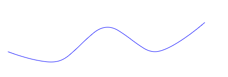

# D3-Shape


**如何使用D3创建 `lines(线)`、 `Areas(区域/面积)`、 ` Tacks areas(堆叠区域/面积)`、`Pies(饼图)`和`Symbols(符号)`等常用图表形状。**

本章介绍 D3 提供的用于绘制线条等形状的函数：


曲线：




饼图段：


和符号：


### SVG

上述示例中的形状由 SVG`path`元素组成。每一个path都有一个`d`定义路径形状的属性（路径数据）。

路径数据由`M0,80L100,100L200,30L300,50L400,40L500,80`描述路径形状的命令列表组成。每个字母例如`M(移动到)`或`L(画线到)`描述一个命令。请参阅[SVG 规范](https://www.w3.org/TR/SVG/paths.html)查看更多信息。

您可以自己创建路径数据，但 D3 提供了为您完成工作的生成器函数。它们有多种形式：

| **Line**   | **为多段线生成路径数据（通常用于折线图）**                 |
| ---------- | ---------------------------------------------------------- |
| **Area**   | **生成区域(面积)的路径数据（通常用于堆叠折线图和流线图）** |
| **Stack**  | **从多系列数据生成堆栈数据**                               |
| **Arc**    | **生成弧的路安然通常用于饼图）**                           |
| **Pie**    | **从数据数组生成饼角数据**                                 |
| **Symbol** | **为加号、星号、菱形等符号生成路径数据**                   |

接下来分别介绍一下:

## line

D3 的线生成器(line generator)在给定**坐标数组**的情况下生成返回路径数据字符串。
通过以下命令创建线生成器d3.line()：

```
let lineGenerator = d3.line();
```

`d3.line()`返回一个接受坐标数组并输出路径数据字符串的函数。

让我们定义一个坐标数组：

```
let points = [
    [0, 80],
    [100, 100],
    [200, 30]
];
```

将该数组在`lineGenerator`作为参数进行调用：

```
var pathData = lineGenerator(points); 
```

`lineGenerator`从点数组创建一串`M`和`L`命令。

您可以使用`pathData`来设置元素的`d`属性：`path`

```
d3.select('path')
  .attr('d', pathData);
```


> https://codepen.io/wantnocode/pen/gOeQQNK

### line.x(),line.y()

默认情况下，每个数组元素代表一个由二维数组（例如[[0, 100],[100, 100]]）定义的坐标。.x, .y的方法可以指定行生成器如何解释每个数组元素。

> 在使用line()指定了x或y，则将相应的访问器设置为指定的函数或数字并返回此行生成器。

假设我们的数据是这样一个**对象数组**：

```
let data = [
    {value: 80}, 
    {value: 100}, 
    {value: 30}, 
    {value: 40}, 
    {value: 20}
];
```

那么我就们可以通过x,y来进行指定生成器具体的访问。

```
let lineGenerator = d3.line()
    .x(function(d, i) {
        return i * 10;  // 返回对象所在索引 * 10;
    })
    .y(function(d) {
        return d.value; // 返回对象的value属性;
    });
// 同样调用lineGenerator进行生成。
let line = lineGenerator(data);

d3.select('path')
    .attr('d', line);
```


> 

上图看着x轴”挤压”很严重 我们可以利用**d3.sscaleLinear()** 指定域的区间进行比例线性放大：

```
let xScale = d3.scaleLinear().domain([0, 6]).range([0, 600]);

let lineGenerator = d3.line()
    .x(function(d, i) {
    return xScale(i);
    // return i * 10;
    })
    .y(function(d) {
    return d.value;
    });
```


> 传递给`.x`and`.y`方法（和其他类似方法）的函数称为**访问函数**。

### .curve()

如果想绘制曲线可以利用.curve()这个方法进行选择插值填充方式。

```
let lineGenerator = d3.line()
    .x(function(d, i) {
    return xScale(i);
    })
    .y(function(d) {
    return d.value;
    })
    .curve(d3.curveCardinal);  // 俩点内均匀插值  
```


#### .defined()

> 当数据中存在异常(缺失字段问题) 可以通过defined表示已定义跳过

```
let data = [
    {value: 80}, 
    {value: 100}, 
    {value: 30}, 
    null,
    {value: 40}, 
    {value: 20}
];
```

线的生成器在生产过程中会出现解析错误,

可以使用.defined方法。传入一个函数，true如果数据定义明确，则返回该函数。如果函数返回false，线生成器将跳过它：

```
lineGenerator
  .defined(function(d) {
    return d !== null;
  });
```

在这个情况下调用生成器绘制之后，会在线中留下一段空白区域(面积) (实则就是跳过)：


#### 渲染到画布

默认情况下，形状生成器输出 SVG 路径数据。但是，可以将它们配置为使用以下`.context()`函数绘制到画布元素：

```
var context = d3.select('canvas').node().getContext('2d');

lineGenerator.context(context);

context.strokeStyle = '#999';
context.beginPath();
lineGenerator(points);
context.stroke();
```

### lineRadial()径向线

> 使用默认设置构造一个新的径向线生成器。径向线生成器等效于标准笛卡尔线生成器，除了x和y访问器被角度和半径访问器替换。径向线总是相对于⟨0,0⟩定位

```
var radialLineGenerator = d3.lineRadial();
var points = [
  [0, 80],
  [Math.PI * 0.25, 80],
  [Math.PI * 0.5, 30],
  [Math.PI * 0.75, 80],
  [Math.PI, 80],
  [Math.PI * 1.25, 80],
  [Math.PI * 1.5, 80],
  [Math.PI * 1.75, 80],
  [Math.PI * 2, 80]
];
var pathData = radialLineGenerator(points);
```


**lineRadial**和**line**同样提供**curve()**,**defined()**方法 并提供自己所需要的的**angle,radius**;所以如果你的数据是对象数组的话,也可以按下面的编写方式:

```
// 注:此处代码需要改造
let points = [
    {a: Math.PI * 0.75, r: 80},
    ...
]
radialLineGenerator
  .angle(function(d) {
    return d.a;
  })
  .radius(function(d) {
    return d.r;
  });
```


## Curves

> 曲线通常不直接构建或使用，而是传递给line.curve和area.curve, 在之前line部分已经做过了简单介绍,我们这节展开再深入了解下。

line定义为二维 [ x , y ] 点的序列，并且区域类似地由顶线和基线定义，但仍然存在将这种离散表示转换为连续形状的任务,即:如何在点之间进行插值(插入更多的顶点)。 为达到不同插值的方式目的, 所以提供了多种曲线生成。

```
let lineGenerator = d3.line()
    .curve(d3.curveCatmullRom.alpha(0.5));
let points = [
    [0, 80],
    [100, 100],
    [200, 30],
    [300, 80],
    [400, 20],
];


let pathData = lineGenerator(points);

d3.select('path')
    .attr('d', pathData);
```


## 内置曲线工厂(函数)

D3内部支持了一些函数构造的方法。**注意生成的是路径数据 还是需要依赖line 或者 area。** 包含以下内容:

> 以下内容可以对实现内容有哪些进行了解 无需太深入了解 ; 至于内部实现有兴趣的同学可以参考B-spline, P-spline , bezier ..相关计算机图形学曲线知识——[维基百科](https://en.wikipedia.org/wiki/B-spline)

- curveBasis
- curveBasisClosed
- curveBasisOpen
- curveBumpX
- curveBumpY
- curveBundle
- curveCardinal
- curveCardinalClosed
- curveCardinalOpen
- curveCatmullRom
- curveCatmullRomClosed
- curveCatmullRomOpen
- curveLinear
- curveLinearClosed
- curveMonotoneX
- curveMonotoneY
- curveNatural
- curveStep
- curveStepAfter
- curveStepBefore

```
// line生成器
let lineGenerator = d3.line();
// 数据
let points = [
    [0, 80],
    [100, 100],
    [200, 30],
    [300, 80],
    [400, 20],
];
// 内部支持的曲线工厂(函数)
let curves = ['curveBasis','curveBasisClosed','curveBasisOpen','curveBumpX','curveBumpY','curveBundle','curveCardinal','curveCardinalClosed','curveCardinalOpen','curveCatmullRom','curveCatmullRomClosed','curveCatmullRomOpen','curveLinear','curveLinearClosed','curveMonotoneX','curveMonotoneY','curveNatural','curveStep','curveStepAfter','curveStepBefore']
// 依次渲染
let i = 0;
setInterval(function(){
    let pathData = lineGenerator.curve(d3[curves[i]])(points);
    d3.select('path')
        .attr('d', pathData);
    d3.select('text')
        .text(function(d) {
            return 'd3.' + curves[i];
        });
    i++;
    if(i === curves.length - 1){
        i = 0;
    }
},800)
```


## Areas 

`Areas`区域(面积)生成器(`area generator`) 是由俩条界线生成的区域(面积), (输出的是两条线之间区域(面积)的路径数据).
区域(面积)生成器产生一个区域(面积)，如区域(面积)图。一个区域(面积)由两条边界线（样条线或折线）定义。通常，**两条线共享相同的x值（x0 = x1），仅在y值（y0和y1）上有所不同；最常见的是，y0 被定义为表示零的常数。第一行（topline）由 x1 和 y1 定义并首先渲染；第二条线（基线）由 x0 和 y0 定义并呈现第二个，点以相反的顺序呈现**。用曲线线性曲线 ，这会产生一个顺时针多边形。

### d3.area([x][, y0][, y1])

```
// 面积生成器
let areaGenerator = d3.area();
// 坐标集合数据
let points = [
    [0, 60],
    [100, 100],
    [200, 40],
    [300, 60],
    [400, 40],
    [500, 90]
];
//生成区域路径数据
let pathData = areaGenerator(points);

// 通过path绘制
d3.select('path')
    .attr('d', pathData);
```


### Areas-x,y 坐标

- `x` 如果指定了x，则将x0设置为x并将x1设置为 null 并返回此区域生成器。如果未指定x ，则返回当前 x0 访问器。
- `x0` 如果指定了x，则将 x0 访问器设置为指定的函数或数字并返回此区域生成器。如果未指定x ，则返回当前 x0 访问器，默认值为:d[0]
- `x1` 如果指定了x，则将 x1 访问器设置为指定的函数或数字并返回此区域生成器。如果未指定x，则返回当前的 x1 访问器，默认为 null，表示应该将之前计算的x0值用于 x1 值。
- `y` 如果指定了y，则将y0设置为y并将y1设置为 null 并返回此区域生成器。如果未指定y ，则返回当前的 y0 访问器。
- `y0` (基线 baseline) 如果指定了y，则将 y0 访问器设置为指定的函数或数字并返回此区域生成器。如果未指定y ，则返回当前的 y0 访问器，默认为：0
- `y1` (顶线 topline) 如果指定了y，则将 y1 访问器设置为指定的函数或数字并返回此区域生成器。如果未指定y ，则返回当前的 y1 访问器, 默认为： d[1];

> 通俗的解释 x x0 x1为每个界线的x坐标 如果设置了x 则x0 x1 均为x的值; y y0 y1为每个界线的y值 如果设置了y 则y0 y1 均为 y的值。

例如当设置**y0(baseline基线)**的时候:

```
// area生成器
let areaGenerator = d3.area()
    .y0(150); //指定基线y为150;

let points = [
    [0, 60],
    [100, 100],
    [200, 40],
    [300, 60],
    [400, 40],
    [500, 90]
];
//生成区域路径数据
let pathData = areaGenerator(points);
//绘制
d3.select('path')
    .attr('d', pathData);
```


所有的访问器均可设置为函数进行传递(可以解决数据结构问题,转换问题等等):

```
// area生成器
let areaGenerator = d3.area();
// 界线数据集合
let points = [
  {x: 0, y0: 30, y1: 60},
  {x: 100, y0: 80, y1: 100},
  {x: 200, y0: 20, y1: 40},
  {x: 300, y0: 20, y1: 60},
  {x: 400, y0: 10, y1: 40},
  {x: 500, y0: 50, y1: 90}
];
// area生成器 相关坐标访问器配置
areaGenerator
  .x(function(d) {
    return d.x;
  })
  .y0(function(d) {
      return d.y0;
  })
  .y1(function(d) {
      return d.y1;
  });
// 生成区域路径数据
let pathData = areaGenerator(points);
//绘制
d3.select('path')
        .attr('d', pathData);
```


### context

> context与lines绘制使用规则一致;

### areaRadial

- angle 角度 等效于x **注意:通常使用角度 不单独使用起始结束角度**
- startAngle 起始角度 等效于x0 **注意:通常使用角度 不单独使用起始结束角度**
- endAngle 结束角度 等效于x1 **注意:通常使用角度 不单独使用起始结束角度**
- radius 半径
- innerRadius 内半径
- outerRadius 外半径
- defined 默认设置 (可以处理异常数据的跳过，参考之前的介绍）
- curve 曲线设置 默认为curveLinear。
- context 绘制上下文,参考line部分

> 径向面积生成器与面积生成器类似，但点由角度(起点默认为12点方向且为顺时针)和半径转换，而不是x和y：

```
let points = [
  {angle: 0, r0: 30, r1: 70},
  {angle: Math.PI * 0.5, r0: 30, r1: 70},
  {angle: Math.PI, r0: 30, r1: 70},
  {angle: Math.PI * 1.5, r0: 30, r1: 70},
  {angle: Math.PI * 2, r0: 30, r1: 70},

];

let radialAreaGenerator = d3.radialArea()
  .angle(function(d) {
    return d.angle;
  })
  .innerRadius(function(d) {
    return d.r0;
  })
  .outerRadius(function(d) {
    return d.r1;
  });


let pathData = radialAreaGenerator(points);


d3.select('path')
        .attr('d', pathData);
```


## Arcs

### Arc()

**利用弧生成器(Arc generator)可以产生圆形或环形扇区，如饼图或圆环图。根据角度和半径值生成路径数据。**
使用以下方法创建弧生成器：

```
let arcGenerator = d3.arc();
```

然后传递所需要的的参数startAngle(圆弧起始点,单位为弧度), endAngle(圆弧结束点), innerRadius(内半径), outerRadius(外半径):

> 注: 弧度是角度的度量单位,一周的弧度数为2πr/r=2π，360°角=2π弧度，因此，1弧度约为57.3°; 1°为π/180弧度，近似值为0.01745弧度，周角为2π弧度，平角（即180°角）为π弧度，直角为π/2弧度。

```
let arcGenerator = d3.arc();
// 绘制所需要的参数的数据
var arcs = [
    {startAngle: 0, endAngle: 10,innerRadius:10, outerRadius:60},
];
// 为path元素绑定d属性
d3.select('g')
    .selectAll('path')
    .data(arcs)
    .join('path')
    .attr('d', arcGenerator);
```


当startAngle(圆弧起始点,单位为弧度), endAngle(圆弧结束点), innerRadius(内半径), outerRadius(外半径)任意参数不需要每次通过数据改变,那么就可以换个写法:

```
arcGenerator
  .innerRadius(10)
  .outerRadius(60);
let arcs = [
      {startAngle: 0, endAngle: 10}
];
d3.select('g')
    .selectAll('path')
    .data(arcs)
    .join('path')
    .attr('d', arcGenerator);
```

还可以配置圆角半径 ( cornerRadius) 和弧段之间的填充 (padAngle和padRadius) **弧形填充有两个参数padAngle，padRadius当它们相乘时，定义了相邻段之间的距离 因此，在上面的示例中，填充距离为0.02 \* 100 = 2**：

```
arcGenerator
  .innerRadius(10)
  .outerRadius(60)
  .padAngle(.02)
  .padRadius(100)
  .cornerRadius(4);
let arcs = [
    {startAngle: 0, endAngle: Math.PI / 2},
    {startAngle: Math.PI / 2, endAngle: Math.PI },
];
d3.select('g')
    .selectAll('path')
    .data(arcs)
    .join('path')
    .attr('d', arcGenerator);
```


如果在数据结构发生变化时,例如参数名称发生了改变。可以为startAngleendAngle定义访问器。例如：

```
//新的数据结构 参数名称变化
let arcs = [
    {new_startAngle: 0, new_endAngle: Math.PI / 2},
    {new_startAngle: Math.PI / 2, new_endAngle: Math.PI },
];
// 建立访问器
arcGenerator
  .startAngle(function(d) {
    return d.new_startAngle;
  })
  .endAngle(function(d) {
    return d.new_endAngle;
  });
```

### arc.centroid()

计算由给定参数生成的圆弧中心线的中点 **[ x , y ]** 。论点是任意的；它们与对象一起简单地传播到弧生成器的访问器函数。为了与生成的弧一致，访问器必须是确定性的，即，在给定相同参数的情况下返回相同的值。中点定义为 **(startAngle + endAngle) / 2** 和 **(innerRadius + outerRadius) / 2** 。比如在挂一些标签 文本信息就很有用处。

```
let arcGenerator = d3.arc()
    .innerRadius(10)
    .outerRadius(60);

let arcData = [
    {label: '1',startAngle: 0, endAngle: Math.PI / 2},
    {label: '2',startAngle: Math.PI / 2, endAngle: Math.PI },
];
// 绘制arc
d3.select('g')
    .selectAll('path')
    .data(arcData)
    .join('path')
    .attr('d', arcGenerator);
// 创建文本并使用centroid
d3.select('g')
    .selectAll('text')
    .data(arcData)
    .join('text')
    .each(function(d) {
        let centroid = arcGenerator.centroid(d); //使用centroid 质心
        d3.select(this)
            .attr('x', centroid[0])
            .attr('y', centroid[1])
            .attr('dy', '0.33em')
            .text(d.label);
    });
```


## Pies

### Pie

**饼图生成器不直接生成形状，而是计算必要的角度以将表格数据集表示为饼图或圆环图；然后可以将这些角度传递给电弧发生器。为给定的`数组`数据生成一个饼图，返回一个表示每个基准的弧角的对象数组,参数包含以下内容:**

- **data**- 输入数据；输入数据数组中的相应元素。
- **value**- 弧的数值。
- **index**- 弧的从零开始的排序索引。
- **startAngle**- 圆弧的起始角度 弧度单位。
- **endAngle**- 圆弧的结束角度 弧度单位。
- **padAngle**- 圆弧之间的相邻角度 弧度单位。

```
let pieGenerator = d3.pie();
let data = [10, 40, 50];
let arcData = pieGenerator(data);
console.log(arcData);
// ==============array
// [{
//     "data": 10,
//     "endAngle": 6.283185307179586,
//     "index": 2,
//     "padAngle": 0,
//     "startAngle": 5.654866776461628,
//     "value": 10,
// },...]
```

然后可以使用**arc generator**(弧生成器)创建路径字符串:

```
let arcGenerator = d3.arc()
    .innerRadius(20)
    .outerRadius(100);
// 利用path进行绘制
d3.select('g')
  .selectAll('path')
  .data(arcData)
  .enter()
  .append('path')
  .attr('d', arcGenerator);
```


### Pies configuration functions(配置函数)

- value
- sortValues
- startAngle
- endAngle
- padAngle

#### startAngle起始角度, endAngle结束角度

**startAngle()**并**endAngle()**配置饼图的起止角度,假如需要设置只允许绘制半圆, 示例如下:

```
let pieGenerator = d3.pie()
    .startAngle(0)
    .endAngle(Math.PI);
// 同样利用arc生成路径字符串,以及利用path进行绘制。
let data = [10, 40, 50];
let arcData = pieGenerator(data);

let arcGenerator = d3.arc()
.innerRadius(20)
.outerRadius(100);

d3.select('g')
.selectAll('path')
.data(arcData)
.enter()
.append('path')
.attr('d', arcGenerator);
```


### value

当我们指定了value，就将 value 访问器设置为指定的函数或数字并返回此饼图生成器:

```
// pie 饼图生成器
let pieGenerator = d3.pie()
    .value(function(d) {return d.val});
// 数据
let list = [
      {name: 'wlove1', val: 40},
      {name: 'wlove2', val: 50},
      {name: 'wlove3', val: 10}
];
// 利用Pie生成器构建arcData
let arcData = pieGenerator(list);
// arc生成器 并指定内半径 外半径
let arcGenerator = d3.arc()
    .innerRadius(20)
    .outerRadius(100);
// 利用g元素下面的path进行绘制
d3.select('g')
    .selectAll('path')
    .data(arcData)
    .enter()
    .append('path')
    .attr('d', arcGenerator);
```


### sortValues() sort() 排序

**sortValues()** 如果指定了**比较(compare)**方式，则将值比较器设置为指定的函数并返回此饼图生成器。如果未指定比较方式 ，则返回当前值比较器，默认为递减值(默认为降序那么结果就是上面图所展示的样子展示):

```
function(a,b){
    return b - a;
}
```

当我们改变为升序进行显示(**可以看到下图与上面的所展示正好相反**)：

```
let pieGenerator = d3.pie()
    .value(function(d) {return d.val})
    .sortValues(function(a,b){return a - b});  // 升序
    // .sortValues(function(a,b){return b - a});

let list = [
{name: 'wlove1', val: 40},
{name: 'wlove2', val: 50},
{name: 'wlove3', val: 10}
];

let arcData = pieGenerator(list);
let arcGenerator = d3.arc()
.innerRadius(20)
.outerRadius(100);

d3.select('g')
.selectAll('path')
.data(arcData)
.enter()
.append('path')
.attr('d', arcGenerator);
```


**sort()**如果未指定,那么还是按照上面的value的降序生成;如果进行了指定, 则将数据比较器设置为指定的函数并返回此饼图生成。

> **localeCompare()** 方法返回一个数字来指示一个参考字符串是否在排序顺序前面或之后或与给定字符串相同。如果引用字符存在于比较字符之前则为负数; 如果引用字符存在于比较字符之后则为正数; 相等的时候返回 0 .

```
let pieGenerator = d3.pie()
    .value(function(d) {return d.val})
    .sort((a, b) => a.name.localeCompare(b.name)); //排序

let list = [
    {name: 'wlove1', val: 40},
    {name: 'wlove2', val: 50},
    {name: 'wlove3', val: 10}
];

let arcData = pieGenerator(list);
let arcGenerator = d3.arc()
    .innerRadius(20)
    .outerRadius(100);
// 利用path进行绘制
d3.select('g')
    .selectAll('path')
    .data(arcData)
    .enter()
    .append('path')
    .attr('d', arcGenerator);
// 利用text元素绘制文字, 利用centroid获取坐标信息
d3.select('g')
    .selectAll('text')
    .data(arcData)
    .join('text')
    .each(function(d) {
        var centroid = arcGenerator.centroid(d);
        d3.select(this)
            .attr('x', centroid[0])
            .attr('y', centroid[1])
            .attr('dy', '0.33em')
            .text(d.data.name);
    });
```


## Stacks

与饼图(`Pies`)生成器一样，堆叠生成器不会直接生成形状。相反，它计算位置，然后您可以将其传递给**(`Areas`)**面积生成器或直接使用，例如定位条。

堆叠(Stacks)生成器接受一个对象数组并为每个对象属性生成一个数组。每个数组包含每个数据点的下限值和上限值。计算下限值和上限值，以便每个系列都堆叠在前一个系列的顶部。

```
var colors = ['#FBB65B', '#513551', '#de3163'];

var data = [
  {apricots: 120, blueberries: 180, cherries: 100},
  {apricots: 60, blueberries: 185, cherries: 105},
  {apricots: 100, blueberries: 215, cherries: 110},
  {apricots: 80, blueberries: 230, cherries: 105},
  {apricots: 120, blueberries: 240, cherries: 105}
];

var stack = d3.stack()
  .keys(['apricots', 'blueberries', 'cherries']);

var stackedSeries = stack(data);

// Create a g element for each series
var g = d3.select('g')
    .selectAll('.series')
    .data(stackedSeries)
    .enter()
    .append('g')
    .classed('series', true)
    .style('fill', function(d, i) {
        return colors[i];
    });

// For each series create a rect element for each day
g.selectAll('rect')
    .data(function(d) {
        return d;
    })
    .join('rect')
    .attr('width', function(d) {
        return d[1] - d[0];
    })
    .attr('x', function(d) {
        return d[0];
    })
    .attr('y', function(d, i) {
        return i * 20;
    })
    .attr('height', 19);
```


与面积生成器结合使用时，堆叠折线图：

```
var yScale = d3.scaleLinear().domain([0, 600]).range([200, 0]);

var areaGenerator = d3.area()
    .x(function(d, i) {
        return i * 100;
    })
    .y0(function(d) {
        return yScale(d[0]);
    })
    .y1(function(d) {
        return yScale(d[1]);
    });

var colors = ['#FBB65B', '#513551', '#de3163'];

var data = [
    {day: 'Mon', apricots: 120, blueberries: 180, cherries: 100},
    {day: 'Tue', apricots: 60, blueberries: 185, cherries: 105},
    {day: 'Wed', apricots: 100, blueberries: 215, cherries: 110},
    {day: 'Thu', apricots: 80, blueberries: 230, cherries: 105},
    {day: 'Fri', apricots: 120, blueberries: 240, cherries: 105}
];

var stack = d3.stack()
    .keys(['apricots', 'blueberries', 'cherries']);

var stackedSeries = stack(data);

d3.select('g')
.selectAll('path')
.data(stackedSeries)
.join('path')
.style('fill', function(d, i) {
    return colors[i];
})
.attr('d', areaGenerator)
```


https://observablehq.com/@d3/streamgraph-transitions

```
let yScale = d3.scaleLinear().domain([0, 800]).range([200, 0]);

let areaGenerator = d3.area()
    .x(function(d, i) {
        return i * 50;
    })
    .y0(function(d) {
        return yScale(d[0]);
    })
    .y1(function(d) {
        return yScale(d[1]);
    })
    .curve(d3.curveCatmullRom);

let colors = ['#FBB65B', '#FBCF3B', '#de3163', '#4A79A4'];

let data = [
    {day: 1, apricots: 100, bananas: 140, cherries: 105, damsons: 80},
    {day: 2, apricots: 110, bananas: 150, cherries: 105, damsons: 40},
    {day: 3, apricots: 130, bananas: 160, cherries: 115, damsons: 50},
    {day: 4, apricots: 110, bananas: 200, cherries: 110, damsons: 90},
    {day: 5, apricots: 100, bananas: 220, cherries: 105, damsons: 120},
    {day: 6, apricots: 120, bananas: 240, cherries: 105, damsons: 150},
    {day: 7, apricots: 80, bananas: 230, cherries: 105, damsons: 150},
    {day: 8, apricots: 100, bananas: 215, cherries: 110, damsons: 100},
    {day: 9, apricots: 60, bananas: 185, cherries: 105, damsons: 150},
    {day: 10, apricots: 120, bananas: 180, cherries: 130, damsons: 150}
];

let stack = d3.stack()
    .keys(['apricots', 'bananas', 'cherries', 'damsons'])
    .order(d3.stackOrderInsideOut)
    .offset(d3.stackOffsetWiggle);

let stackedSeries = stack(data);

d3.select('g')
    .selectAll('path')
    .data(stackedSeries)
    .join('path')
    .style('fill', function(d, i) {
        return colors[i];
    })
    .attr('d', areaGenerator)
```


## Symbols 

### symbol()

符号生成器为数据可视化中常用的符号生成路径数据。符号始终以⟨0,0⟩为中心；使用变换（参见：[SVG](https://www.w3.org/TR/SVG/coords.html#TransformAttribute)、[Canvas](https://html.spec.whatwg.org/multipage/#transformations)）将符号移动到不同的位置。：

```
//符号生成器 type为star 大小为80
let symbolGenerator = d3.symbol()
    .type(d3.symbolStar)
    .size(80);
//顶点数据
let points = [
    [0, 80],
    [100, 100],
    [200, 30],
    [300, 50],
    [400, 40],
    [500, 80]
];
//构建生产路径字符串数据
let pathData = symbolGenerator();
// 利用path绘制
d3.select('g')
    .selectAll('path')
    .data(points)
    .join('path')
    .attr('transform', function(d) {
        return 'translate(' + d + ')';
    })
    .attr('d', pathData);
```


### 支持的symbol类型

- symbolCircle 圆形符号类型
- symbolCross 希腊十字符号类型
- symbolDiamond 菱形符号类型 用于填充(filling)
- symbolDiamond2 菱形符号类型 用于描边(stroking)
- symbolSquare 方形符号类型 用于填充(filling)
- symbolSquare2 方形符号类型 用于描边(stroking)
- symbolStar 五角星符号类型
- symbolTriangle 正三角符号类型
- symbolTriangle2 正三角符号类型
- symbolWye Y形符号类型
- symbolX X形符号类型

```
// 符号生成器 size设置为100
let symbolGenerator = d3.symbol()
    .size(100);

//符号类型集合
let symbolTypes = ['symbolCircle', 'symbolCross', 'symbolDiamond', 'symbolSquare', 'symbolStar', 'symbolTriangle', 'symbolWye'];

//设置scale比例函数, 将数据值转换为(映射为)视觉变量
let xScale = d3.scaleLinear().domain([0, symbolTypes.length - 1]).range([0, 700]);

//利用g-path绘制所有符号
d3.select('g')
    .selectAll('path')
    .data(symbolTypes)
    .join('path')
    .attr('transform', function(d, i) {
        return 'translate(' + xScale(i) + ', 0)';
    })
    .attr('d', function(d) {
        symbolGenerator
            .type(d3[d]);

        return symbolGenerator();
    });

//利用g-text绘制所有符号的文本说明
d3.select('g')
    .selectAll('text')
    .data(symbolTypes)
    .join('text')
    .attr('transform', function(d, i) {
        return 'translate(' + xScale(i) + ', 40)';
    })
    .text(function(d) {
        return 'd3.' + d;
    });
```


