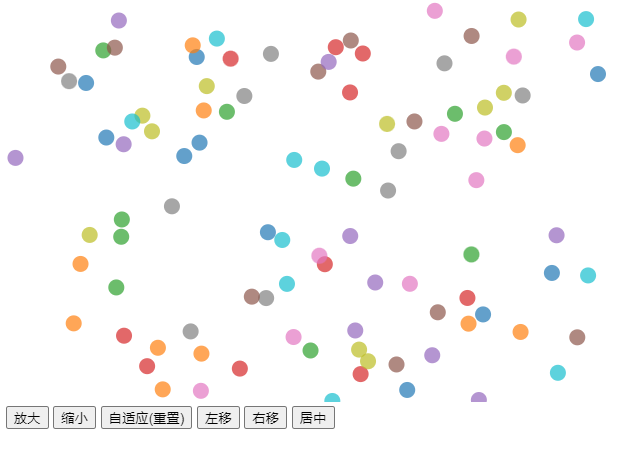

# D3 缩放和平移

*D3 提供了一个模块“`D3.zoom`，提供为 HTML 或 SVG 元素添加缩放和平移行为。本文展示了如何创建缩放行为、如何添加缩放和平移做限制约束。*

D3 可以为 HTML 或 SVG 元素添加**缩放**和**平移**行为。在以下示例中，单击并移动鼠标进行平移并使用鼠标滚轮进行缩放：


> https://codepen.io/wantnocode/pen/vYRPxXx

向元素添加缩放和平移行为需要三个步骤：

- 调用`d3.zoom()`创建**缩放行为**函数
- 添加在发生缩放或平移事件时调用的事件处理程序。事件处理程序接收可应用于图表元素的转换
- 将缩放行为附加到接收缩放和平移手势的元素

区分**接收缩放和平移手势**的 HTML 或 SVG 元素与**被缩放和平移**的元素（被转换的元素）是有帮助的。重要的是这些元素是不同的，否则平移将无法正常工作。

调用`d3.zoom()`会创建缩放行为：

```
let zoom = d3.zoom();
```

> `d3.zoom`这个模块包含处理缩放**和**平移事件。

> 缩放行为是一种将事件处理程序（用于拖动、鼠标滚轮事件和触摸事件等）添加到元素的函数。它也有方法，如在`.on`其上定义的。

`可以通过`.on`调用该方法将事件处理程序附加到缩放行为上。接受两个参数：

- 事件类型 (`zoom`）
- 事件处理函数(`匿名或命名函数`)

```
function handleZoom(e) {
 // 平移或者缩放
}

let zoom = d3.zoom()
  .on('zoom', handleZoom);
```

> 事件类型`'zoom'`包含`'start'`和`'end'`。`'zoom'`表示变换的变化（例如用户已缩放或平移）。`'start'`表示缩放或平移的开始（例如，用户按下了鼠标按钮）。`'end'`表示缩放或平移的结束（例如，用户已松开鼠标按钮）。

`handleZoom`接收单个参数`e`，该参数是表示缩放事件的对象。这个对象最有用的属性是`transform`. 这是一个代表最新缩放变换的对象，通常应用于图表元素：

```
function handleZoom(e) {
  d3.select('g.chart')
    .attr('transform', e.transform);
}
```

> ```
> e.transform`有三个属性 x,y,k。 x,y指定平移变换。k表示缩放比例因子。
> ```

通过选择元素并将缩放行为传递给[`.call`方法]()，您可以将缩放行为附加到元素：

```
d3.select('svg')
  .call(zoom);
```

> 缩放行为是在选定元素上设置事件侦听器的函数（`svg`在上面的示例中）。当缩放和平移事件发生时，会计算一个转换并将其传递给事件处理程序（`handleZoom`在上面的示例中）。

### 例子

假设您有一个包含一个元素的 SVG`g`元素：

```
<svg width="600" height="400">
  <g></g>
</svg>
```

在以下代码中，使用元素创建缩放行为`d3.zoom()`并将其附加到`svg`元素。

`handleZoom`被传递到`.on`方法中。当缩放或平移发生时，`handleZoom`被调用。这会将变换应用于`e.transform`元素`g`。

```
function handleZoom(e) {
  d3.select('svg g')
    .attr('transform', e.transform);
}

let zoom = d3.zoom()
  .on('zoom', handleZoom);

d3.select('svg')
  .call(zoom);
```

这是一个完整的示例，其中将随机坐标数组连接到`circle`元素：

```
let data = [], width = 600, height = 400, numPoints = 100;

let zoom = d3.zoom()
  .on('zoom', handleZoom);

function handleZoom(e) {
  d3.select('svg g')
    .attr('transform', e.transform);
}

function initZoom() {
  d3.select('svg')
    .call(zoom);
}

function updateData() {
  data = [];
  for(let i=0; i<numPoints; i++) {
    data.push({
      id: i,
      x: Math.random() * width,
      y: Math.random() * height
  	});
  }
}

function update() {
  d3.select('svg g')
    .selectAll('circle')
    .data(data)
    .join('circle')
    .attr('cx', function(d) { return d.x; })
    .attr('cy', function(d) { return d.y; })
    .attr('r', 3);
}

initZoom();
updateData();
update();
```


### 缩放和平移约束

您可以限制缩放和平移，以便用户只能在指定范围内缩放和平移。

`.scaleExtent`可以使用传递数组来限制缩放，`[min, max]`其中`min`是最小比例因子并且`max`是最大比例因子：

```
let zoom = d3.zoom()
  .scaleExtent([1, 5]);
```

您可以使用`.translateExtent`指定`[[x0, y0], [x1, y1]]`用户无法平移的范围：

```
let width = 600, height = 400;

let zoom = d3.zoom()
  .scaleExtent([1, 5])
  .translateExtent([[0, 0], [width, height]]);
```

现在您只能放大到 5 的比例因子。您也不能缩小超过默认比例因子 1。此外，您不能平移超出图表的范围：


> https://codepen.io/wantnocode/pen/rNdRyQO

### 编程方式进行缩放控制

可以通过编程方式进行缩放和平移。例如，可以创建缩放/平移图表的按钮。

缩放行为具有以下以编程方式设置缩放和平移的方法：

| 方法名称       | 描述                                                         |
| :------------- | :----------------------------------------------------------- |
| `.translateBy` | 将给定的`x, y`偏移量添加到当前变换                           |
| `.translateTo` | 设置变换，使给定`x, y`坐标居中（当给定点上`[px, py]`,将定位至该点） |
| `.scaleBy`     | 将当前比例因子乘以给定值                                     |
| `.scaleTo`     | 将比例因子设置为给定值  参数为1 为 `resetzoom`               |
| `.transform`   | 将变换设置为给定的变换。                                     |

不应直接调用上述方法。相反，它们应该在接收缩放和平移手势的元素上调用。例如：

```
d3.select('svg')
  .call(zoom.scaleBy, 0.5);
```

您还可以在过渡选择上调用这些方法，这会产生很好的效果：

```
d3.select('svg')
  .transition()
  .call(zoom.translateBy, 50, 0);
```

这是使用上述几种方法的完整示例：



```
let data = [], width = 600, height = 400, numPoints = 100;

let zoom = d3.zoom()
	.scaleExtent([0.25, 10])
	.on('zoom', handleZoom);

function updateData() {
	data = [];
	for(let i=0; i<numPoints; i++) {
		data.push({
			id: i,
			x: Math.random() * width,
			y: Math.random() * height
		});
	}
}

function initZoom() {
	d3.select('svg')
		.call(zoom);
}

function handleZoom(e) {
	d3.select('svg g')
		.attr('transform', e.transform);
}

function zoomIn() {
	d3.select('svg')
		.transition()
		.call(zoom.scaleBy, 2);
}

function zoomOut() {
	d3.select('svg')
		.transition()
		.call(zoom.scaleBy, 0.5);
}

function resetZoom() {
	d3.select('svg')
		.transition()
		.call(zoom.scaleTo, 1);
}

function center() {
	d3.select('svg')
		.transition()
		.call(zoom.translateTo, 0.5 * width, 0.5 * height);
}

function panLeft() {
	d3.select('svg')
		.transition()
		.call(zoom.translateBy, -50, 0);
}

function panRight() {
	d3.select('svg')
		.transition()
		.call(zoom.translateBy, 50, 0);
}

function update() {
	d3.select('svg g')
		.selectAll('circle')
		.data(data)
		.join('circle')
		.attr('cx', function(d) { return d.x; })
		.attr('cy', function(d) { return d.y; })
		.attr('r', 8)
    .attr("fill", (d, i) => d3.schemeCategory10[i % 10]);
}

initZoom();
updateData();
update();


```

